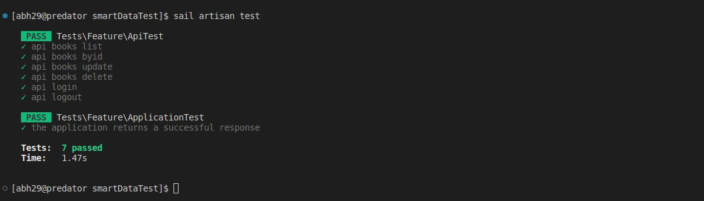
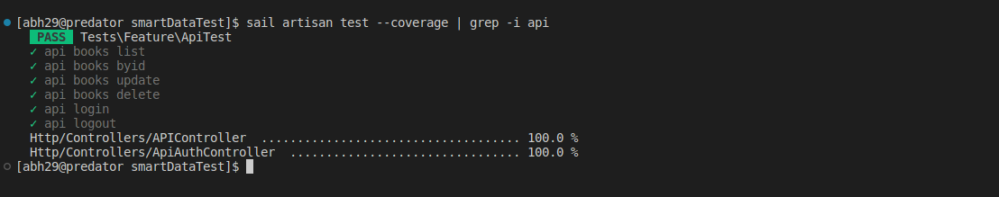

# Test for PHP-internship at SmarData

## Installation
- After cloning this repository run composer install to install the required php packets
- Then coppy the .env.example file and change it accordingly to what you have
- It is highly recomended that you use laravel/sail for that :
    - - make sure that you have docker installed and running
    - - run sail install and choose your db this project requires only a database and a server
- Start your server by running sail up
- Go to your localhost address and make sure that the server is running
- Now you need to run the migrations with sail php artisan migrate
- It is imperative that you have at least one user in the application  
    but for logical reasons we don't have a registation route for this  
    you can just run sail php artisan db:seed  
    this command will create a user to the db named: admin  
    and will also fill the db with some fake data for authors and books  
    just so it didn't look empty.
- Now we can start browsing the application
- For the adming section just use :
    - email: admin@example.com
    - passord: password

## Api
- To test the api you can use postman or any other client
- The route: GET /api/v1/books/list will show a list of all the books  
    that are currently in the DB
- The route: GET /api/v1/books/{id} will show a perticular book with  
    its (int) id = {id}
- The route: POST /api/v1/login enables you to connect to the application  
    and get a api-token, this token is required for adding and deleting books
- The route: POST /api/v1/books/update enables you to update the info of  
    a book, the request must have all data of the book including the id  
    as parameters, and the bearer text token
- The route: DELETE /api/v1/books/{id} let's you delete a book by id   
    you need to provide a valid token as a parameter

### To test the Api run sail artisan test

### you can also run it with sail artisan test --coverage  
    but this requires xdebug to be installed
